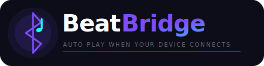
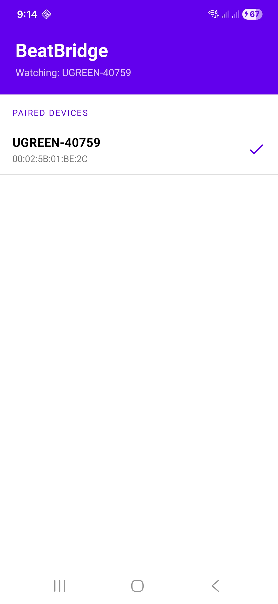

<div align="center">
  

  <br/>

[](https://github.com/brandonp2412/BeatBridge/actions/workflows/ci.yml)
[](LICENSE)
[](https://developer.android.com/about/versions/oreo)
[](https://f-droid.org/packages/com.beatbridge)

**Automatically resume music playback the moment your Bluetooth device connects.**

</div>

---

## What it does

BeatBridge runs a lightweight background service that watches for your chosen Bluetooth device to connect. The instant it does — your car speakers, headphones, or any paired device — BeatBridge fires a **media play** event to resume whatever you were last listening to in Spotify, YouTube Music, Pocket Casts, or any other media app.

No logins. No accounts. No internet. Just music.

## Features

- **One-tap setup** — pick your device from the paired devices list and you're done
- **Works with any media app** — dispatches a standard Android media key event so any player responds
- **Persistent monitoring** — foreground service keeps watching even after you close the app
- **Battery-conscious** — no polling; wakes only on Bluetooth ACL connection events
- **Fully offline** — zero network permissions, zero tracking
- **Open source** — GPL-3.0, available on F-Droid

## Screenshots

<div align="center">
  
</div>

## Requirements

- Android 8.0 (API 26) or higher
- At least one paired Bluetooth device

## Install

### F-Droid _(recommended)_

BeatBridge is available on [F-Droid](https://f-droid.org/packages/com.beatbridge) — every build is verified from source, signed by F-Droid, and free of proprietary blobs.

### Build from source

```bash
git clone https://github.com/brandonp2412/BeatBridge.git
cd BeatBridge
./gradlew assembleRelease
# APK → app/build/outputs/apk/release/app-release-unsigned.apk
```

Requirements: JDK 17, Android SDK with API 36.

### GitHub Releases

Unsigned APKs are attached to each [GitHub Release](https://github.com/brandonp2412/BeatBridge/releases). For a verified, signed build prefer F-Droid.

## Permissions

| Permission                                                   | Why                                              |
| ------------------------------------------------------------ | ------------------------------------------------ |
| `BLUETOOTH_CONNECT` (Android 12+)                            | Read paired device names and addresses           |
| `BLUETOOTH` / `BLUETOOTH_ADMIN` (Android ≤ 11)               | Read paired devices on older OS versions         |
| `FOREGROUND_SERVICE` / `FOREGROUND_SERVICE_CONNECTED_DEVICE` | Keep the monitor service alive                   |
| `POST_NOTIFICATIONS` (Android 13+)                           | Show the persistent "Watching for…" notification |

No location, no storage, no internet.

## How it works

```
User selects device
        │
        ▼
BluetoothMonitorService starts (foreground)
        │
        └─ registers BroadcastReceiver for ACTION_ACL_CONNECTED
                    │
                    ▼
          Device connects? ──No──▶ keep waiting
                    │
                   Yes
                    │
                    ▼
          Address matches selected? ──No──▶ ignore
                    │
                   Yes
                    │
                    ▼
          AudioManager.dispatchMediaKeyEvent(MEDIA_PLAY)
                    │
                    ▼
          Music resumes in active media session ♪
```

## Build & test

```bash
# Unit tests
./gradlew test

# Instrumented tests (requires connected device or emulator)
./gradlew connectedAndroidTest

# Debug build
./gradlew assembleDebug

# Release build
./gradlew assembleRelease
```

## Contributing

Pull requests are welcome. Please:

1. Fork the repo and create a branch: `git checkout -b feature/my-change`
2. Make your changes and add/update tests as needed
3. Ensure `./gradlew test` passes
4. Open a PR with a clear description

## F-Droid

BeatBridge is designed to meet F-Droid inclusion requirements:

- GPL-3.0 licensed
- No proprietary dependencies (only AndroidX + Google Material)
- No network access, no tracking
- Reproducible builds from source via `./gradlew assembleRelease`
- Fastlane metadata in [`fastlane/metadata/android/`](fastlane/metadata/android/)

## Changelog

See [CHANGELOG.md](CHANGELOG.md).

## License

```
BeatBridge — Auto-play music when your Bluetooth device connects
Copyright (C) 2024 BeatBridge Contributors

This program is free software: you can redistribute it and/or modify
it under the terms of the GNU General Public License as published by
the Free Software Foundation, either version 3 of the License, or
(at your option) any later version.
```

Full text: [LICENSE](LICENSE)
