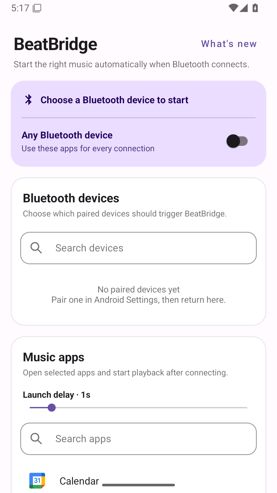
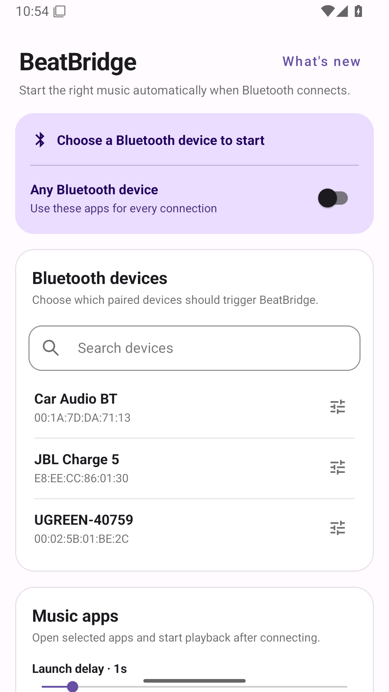
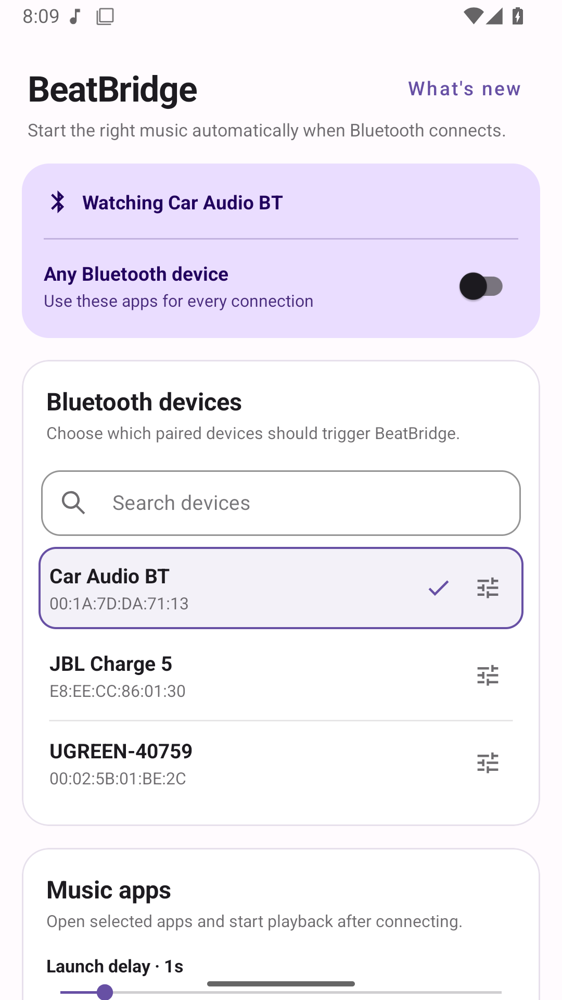
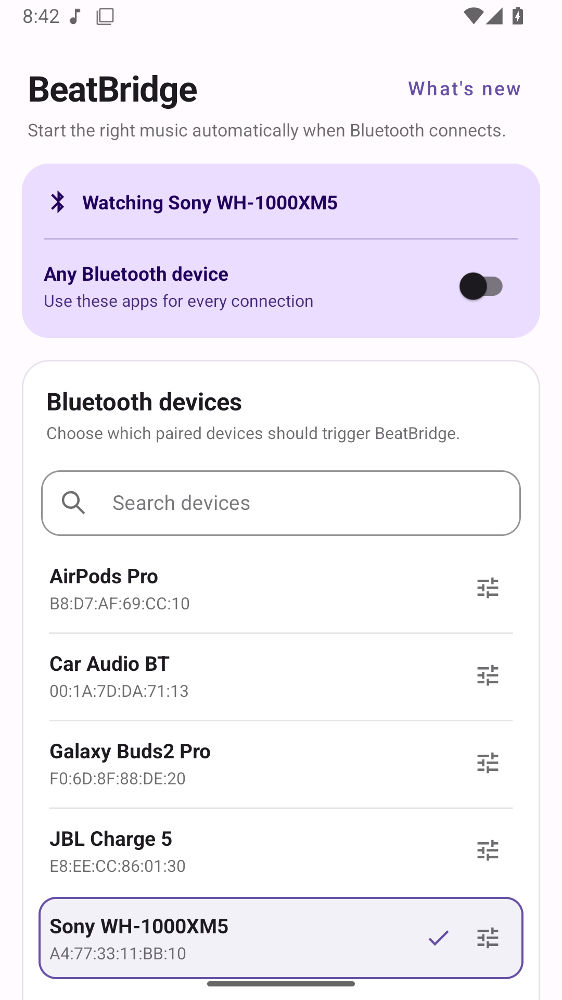

  

  <h1>BeatBridge</h1>

  
<strong>Auto-play music when your Bluetooth car, headphones, or speakers connect.</strong>

  
Pick a device once. BeatBridge handles the rest.

  

## Just connect and listen

BeatBridge watches for the Bluetooth device you choose. When it connects, BeatBridge sends Android's standard media play command so your music, podcast, or audiobook can resume in the app you already use.

No accounts, ads, analytics, or internet access.

## Features

- **Automatic playback** when a selected Bluetooth device connects
- **Works with your existing media apps** through standard Android media controls
- **Ask on connect** when you want to choose what happens instead
- **Per-device equalizer profiles** for different cars, headphones, or speakers
- **Background monitoring** without constant Bluetooth polling
- **Private by design** with your devices and preferences kept on your phone

## Screenshots

  
  
  
  

