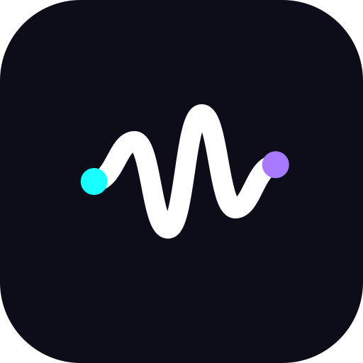

  

  <h1>BeatBridge</h1>

  
<strong>Start playing automatically when your Bluetooth device connects.</strong>

  
Choose a car, speaker, or pair of headphones and BeatBridge will resume your media when it connects.

  

    
    
  

## What it does

Pick a Bluetooth device. When it connects, BeatBridge sends a normal Android play command to whatever media app you were using.

That's it. No account, no ads, no analytics, and no internet connection required.

## Features

- Start playback when a selected Bluetooth device connects
- Works with music, podcast, and audiobook apps that support Android media controls
- Use **Ask on connect** if you'd rather choose what happens each time
- Save a different equalizer profile for each device
- Keeps working in the background after you close the app
- Stores your settings on your phone

## Screenshots

  
  
   
  
  

